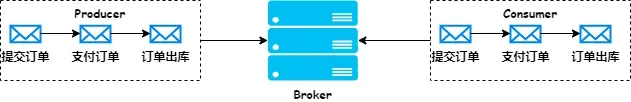

# pulsar-demo

该项目是pulsar使用的实验项目，我将通过该项目依次实验pulsar的核心功能，方便在生产项目中进行实践。

# 功能实验

## 1. 生产者和消费者的简单实践

### 实验的类
* 生产者：cn/bravedawn/producer/ProducerClient.java
* 消费者：cn/bravedawn/consumer/ConsumerClient.java
* 消息内容：cn/bravedawn/schema/DemoData.java

## 2. 重复消息删除功能

1. 首先开启namespace级别的重复数据删除的配置。这个可以参考类cn/bravedawn/broker/NamespaceConfigurationClient.java。按照官方文档的描述其实也可以针对topic维度设置重复数据删除的配置，但是我发现在最新的client api中已经将topic维度的配置删除了。
2. 然后在生产者中设置三个关键参数：

   * 第一个是producerName，如果未设置名称，则将设置全局唯一名称 由 Pulsar 服务分配。然后应用程序将能够使用 Producer.getName() 获取分配的名称。如果应用程序选择自定义名称，则需要自行确保该名称全局唯一。
   * 第二个是initialSequenceId，该生产者生产消息的初始序列号，发送一个消息该序列号自增1，不设置的话从0开始。
   * 第三个是`sendTimeout(0, TimeUnit.SECONDS)`发送超时时间，将使超时时间设置为无穷大。这在使用 Pulsar 的消息去重功能时非常有用，因为客户端库将不断重试发布消息。不会有任何错误传播回应用程序。
3. 在发送消息的时候，在消息中携带sequenceId，用于标识该消息。具体代码实现参考cn/bravedawn/producer/DeduplicationProducerClient.java。
4. 经过测试发现，针对一个生产者，他的消息sequenceId是递增的，如果当前发送的消息的sequenceId小于等于Broker那里记录的当前生产者的sequenceId，这条消息就会被认为是重复消息。

值得注意的是：Pulsar 的消息去重功能（基于Broker的brokerDeduplicationEnabled 配置）不支持分区主题（partitioned topic）的跨分区去重，只能保证单个分区内的去重。

## 3. 批量发送消息
1. 在生产者配置批处理，满足其中一个条件就会被打包发送出去：
    * 批次大小：batchingMaxBytes
    * 批次条数：batchingMaxMessages
    * 批次延迟发送时间： batchingMaxPublishDelay
    * 开启批量发送，具体参考cn/bravedawn/producer/BatchProducerClient.java。
2. 生产端多个消息会被放到一个批次中进行发送，到了消费端消息会本拆开消费，但是如果一个批次中一个消息发送失败，那么整个批次就会被重新投递，那就有问题了，所以这里需要在broker的配置文件（broker.conf-集群或是standalone.conf）中开启acknowledgmentAtBatchIndexLevelEnabled配置设置为true。
3. 在消费端开启批量索引确认配置。具体参考cn/bravedawn/consumer/BatchConsumerClient.java。

## 4. 消息消费超时和消费重试
1. 消息消费超时是用来保证消息在超时时间内没有被消费，就会被broker重新进行投递，但是消费超时的时间不太好确认，所以一般我们推荐使用消费重试。

2. 消费端开始消费消息，如果出现异常，我们可以调用`reconsumeLater()`和`negativeAcknowledge()`方法来让消息被重新消费，但是这两个方法有所区别。

   1. 先来看`reconsumeLater()`方法

      * 这个方法可以设置二次重试消费的间隔时间、可以携带属性参数。

      * 相较于否定确认，重试信件主题更适合需要大量重试且重试间隔可配置的消息。因为重试信件主题中的消息会持久化到 BookKeeper，而因否定确认而需要重试的消息则会缓存在客户端。

      * 由于我写了两个消费者，一个是普通消费者（可以重试），还有一个是死信队列消费者，下面我们来看下消费者打印的日志

        ```
        // 重新消费
        try {
            Map<String, String> customProperties = new HashMap<String, String>();
            customProperties.put("ORIGIN_MESSAGE_ID", String.valueOf(msg.getSequenceId()));
            consumer1.reconsumeLater(msg, customProperties, 5, TimeUnit.SECONDS);
        } catch (PulsarClientException ex) {
            throw new RuntimeException(ex);
        }
        
        // 普通消费者的日志
        [2025-07-17 13:58:50.681][][][][pulsar-external-listener-14-1][INFO][cn.bravedawn.consumer.RetryConsumerClient.lambda$main$cb6ab996$1(56)]-收到消息: {"name":"test","id":1}, sequenceId=1945724782524334080, property-sequenceId=null 
        [2025-07-17 13:58:50.682][][][][pulsar-external-listener-13-1][INFO][cn.bravedawn.consumer.RetryConsumerClient.lambda$main$cb6ab996$1(56)]-收到消息: {"name":"test","id":0}, sequenceId=1945724768871874560, property-sequenceId=null 
        [2025-07-17 13:58:50.937][][][][pulsar-external-listener-13-1][INFO][cn.bravedawn.consumer.RetryConsumerClient.lambda$main$cb6ab996$1(56)]-收到消息: {"name":"test","id":2}, sequenceId=1945724794410991616, property-sequenceId=null 
        [2025-07-17 13:58:56.714][][][][pulsar-external-listener-12-1][INFO][cn.bravedawn.consumer.RetryConsumerClient.lambda$main$cb6ab996$1(56)]-收到消息: {"name":"test","id":0}, sequenceId=0, property-sequenceId=1945724768871874560 
        [2025-07-17 13:58:56.771][][][][pulsar-external-listener-12-1][INFO][cn.bravedawn.consumer.RetryConsumerClient.lambda$main$cb6ab996$1(56)]-收到消息: {"name":"test","id":1}, sequenceId=0, property-sequenceId=1945724782524334080 
        [2025-07-17 13:58:56.780][][][][pulsar-external-listener-12-1][INFO][cn.bravedawn.consumer.RetryConsumerClient.lambda$main$cb6ab996$1(56)]-收到消息: {"name":"test","id":2}, sequenceId=1, property-sequenceId=1945724794410991616 
        
        // 死信队列消费者的日志
        [2025-07-17 14:03:19.475][][][][pulsar-external-listener-11-1][INFO][cn.bravedawn.consumer.RetryDeadLetterConsumerClient.lambda$main$cb6ab996$1(33)]-收到死信消息: {"name":"test","id":0}, sequenceId=0, property-sequenceId=0 
        [2025-07-17 14:03:19.478][][][][pulsar-external-listener-11-1][INFO][cn.bravedawn.consumer.RetryDeadLetterConsumerClient.lambda$main$cb6ab996$1(33)]-收到死信消息: {"name":"test","id":1}, sequenceId=1, property-sequenceId=0 
        [2025-07-17 14:03:19.478][][][][pulsar-external-listener-11-1][INFO][cn.bravedawn.consumer.RetryDeadLetterConsumerClient.lambda$main$cb6ab996$1(33)]-收到死信消息: {"name":"test","id":2}, sequenceId=2, property-sequenceId=1 
        ```

        从上面日志的打印中我们可以看到，`reconsumeLater()`方法可以在第二次重复消费时携带第一次消费失败后赋予的参数信息。

        在死信队列的消费者中我们看到，之前第一次消费失败携带的参数已经被第二次重新消费时重新赋值了。

   2. 接着来看`negativeAcknowledge()`方法

      ```
      // 否定确认
       consumer1.negativeAcknowledge(msg);
      
      // 普通消费者的日志
      [2025-07-17 14:09:24.097][][][][pulsar-external-listener-13-1][INFO][cn.bravedawn.consumer.RetryConsumerClient.lambda$main$cb6ab996$1(56)]-收到消息: {"name":"test","id":1}, sequenceId=1945727114364403712, property-sequenceId=null 
      [2025-07-17 14:09:24.097][][][][pulsar-external-listener-12-1][INFO][cn.bravedawn.consumer.RetryConsumerClient.lambda$main$cb6ab996$1(56)]-收到消息: {"name":"test","id":0}, sequenceId=1945727101374644224, property-sequenceId=null 
      [2025-07-17 14:09:24.206][][][][pulsar-external-listener-13-1][INFO][cn.bravedawn.consumer.RetryConsumerClient.lambda$main$cb6ab996$1(56)]-收到消息: {"name":"test","id":2}, sequenceId=1945727127639375872, property-sequenceId=null 
      [2025-07-17 14:10:24.477][][][][pulsar-external-listener-12-1][INFO][cn.bravedawn.consumer.RetryConsumerClient.lambda$main$cb6ab996$1(56)]-收到消息: {"name":"test","id":0}, sequenceId=1945727101374644224, property-sequenceId=null 
      [2025-07-17 14:10:24.477][][][][pulsar-external-listener-13-1][INFO][cn.bravedawn.consumer.RetryConsumerClient.lambda$main$cb6ab996$1(56)]-收到消息: {"name":"test","id":1}, sequenceId=1945727114364403712, property-sequenceId=null 
      [2025-07-17 14:10:24.479][][][][pulsar-external-listener-13-1][INFO][cn.bravedawn.consumer.RetryConsumerClient.lambda$main$cb6ab996$1(56)]-收到消息: {"name":"test","id":2}, sequenceId=1945727127639375872, property-sequenceId=null 
      
      // 死信消费者的日志
      [2025-07-17 14:12:37.278][][][][pulsar-external-listener-11-1][INFO][cn.bravedawn.consumer.RetryDeadLetterConsumerClient.lambda$main$cb6ab996$1(33)]-收到死信消息: {"name":"test","id":2}, sequenceId=0, property-sequenceId=1627:2:1 
      [2025-07-17 14:12:37.316][][][][pulsar-external-listener-11-1][INFO][cn.bravedawn.consumer.RetryDeadLetterConsumerClient.lambda$main$cb6ab996$1(33)]-收到死信消息: {"name":"test","id":1}, sequenceId=1, property-sequenceId=1627:1:1 
      [2025-07-17 14:12:37.317][][][][pulsar-external-listener-11-1][INFO][cn.bravedawn.consumer.RetryDeadLetterConsumerClient.lambda$main$cb6ab996$1(33)]-收到死信消息: {"name":"test","id":0}, sequenceId=0, property-sequenceId=1628:2:0 
      ```

      从上面的日志中我们可以看到与reconsumeLater()方法的区别，第一点在普通消费者消费消息时消息的sequenceid是不会发生重置的，第二点在死信消费者小的是日志中可以从消息的附加属性中获取到原始消息 ID。

3. 实践参考：

   * 生产者：cn/bravedawn/producer/RetryProducerClient.java
   * 普通消费者：cn/bravedawn/consumer/RetryConsumerClient.java
   * 死信消费者：cn/bravedawn/consumer/RetryDeadLetterConsumerClient.java

### 如果关闭消息重试，但是配置了重试的逻辑，重试会生效吗？

1. 第一种情况，我们修改cn/bravedawn/consumer/RetryConsumerClient.java的代码，如下：

   ```java
   Consumer<DemoData> consumer = client.newConsumer(JSONSchema.of(DemoData.class))
                   .topic("persistent://public/siis/partitionedTopic")
                   .subscriptionName("my-subscription")
                   .subscriptionType(SubscriptionType.Shared)
                   .subscriptionMode(SubscriptionMode.Durable)
                   .enableBatchIndexAcknowledgment(true)
                   .subscriptionInitialPosition(SubscriptionInitialPosition.Earliest)
                   // 关闭消息重试
                   .enableRetry(false)
                   // 构建死信队列策略
                   .deadLetterPolicy(DeadLetterPolicy.builder()
                           // 最大重试投递次数，也就是如果第一次消费失败，还会重新再投递一次
                           .maxRedeliverCount(1)
                           // 死信主题
                           .deadLetterTopic("persistent://public/siis/partitionedTopic-deadLetter")
                           // 重试主题
                           .retryLetterTopic("persistent://public/siis/partitionedTopic-retryLetter")
                           // 配置重试信件主题的生产者
                           .retryLetterProducerBuilderCustomizer(producerBuilderCustomizer)
                           .deadLetterProducerBuilderCustomizer(producerBuilderCustomizer)
                           .build())
                   .messageListener((consumer1, msg) -> {
                       try {
                           log.info("收到消息: {}, sequenceId={}, property-sequenceId={}",
                                   new String(msg.getData()), msg.getSequenceId(), msg.getProperties().get("ORIGIN_MESSAGE_ID"));
                           int i = 1 / 0;
                           consumer1.acknowledge(msg);
                       } catch (Exception e) {
                           log.error("消息消费出现异常", e);
                           // 重新消费
                           try {
                               Map<String, String> customProperties = new HashMap<String, String>();
                               customProperties.put("ORIGIN_MESSAGE_ID", String.valueOf(msg.getSequenceId()));
                               consumer1.reconsumeLater(msg, customProperties, 5, TimeUnit.SECONDS);
                           } catch (PulsarClientException ex) {
                               throw new RuntimeException(ex);
                           }
                       }
                   })
                   .subscribe();
   ```

   在这段代码中，我们使用了`reconsumeLater()`方法，去重新消费消息。但是消费者我们设置了`enableRetry(false)`关闭重试。在这两个条件之下，我们的实验结果表明，如果发送了一条消息过来，这条消息被消费的时候会报错：

   ```
   java.lang.RuntimeException: org.apache.pulsar.client.api.PulsarClientException: reconsumeLater method not supported because retryEnabled is set to false. You can enable it via ConsumerBuilder.
   ```

   意思是说，消费者已经关闭了重试，不能使用reconsumerLater()方法将消息放到重试队列。

   所以，正确的处理方式应该是：
   ```java
   boolean enableEntry = false;
   
   Consumer<DemoData> consumer = client.newConsumer(JSONSchema.of(DemoData.class))
           .topic("persistent://public/siis/partitionedTopic")
           .subscriptionName("my-subscription")
           .subscriptionType(SubscriptionType.Shared)
           .subscriptionMode(SubscriptionMode.Durable)
           .enableBatchIndexAcknowledgment(true)
           .subscriptionInitialPosition(SubscriptionInitialPosition.Earliest)
           // 开启消息重试
           .enableRetry(false)
           // 构建死信队列策略
           .deadLetterPolicy(DeadLetterPolicy.builder()
                   // 最大重试投递次数，也就是如果第一次消费失败，还会重新再投递一次
                   .maxRedeliverCount(1)
                   // 死信主题
                   .deadLetterTopic("persistent://public/siis/partitionedTopic-deadLetter")
                   // 重试主题
                   .retryLetterTopic("persistent://public/siis/partitionedTopic-retryLetter")
                   // 配置重试信件主题的生产者
                   .retryLetterProducerBuilderCustomizer(producerBuilderCustomizer)
                   .deadLetterProducerBuilderCustomizer(producerBuilderCustomizer)
                   .build())
           .messageListener((consumer1, msg) -> {
               try {
                   log.info("收到消息: {}, sequenceId={}, property-sequenceId={}",
                           new String(msg.getData()), msg.getSequenceId(), msg.getProperties().get("ORIGIN_MESSAGE_ID"));
                   int i = 1 / 0;
                   consumer1.acknowledge(msg);
               } catch (Exception e) {
                   log.error("消息消费出现异常", e);
   
                   if (enableEntry) {
                       // 重新消费
                       try {
                           Map<String, String> customProperties = new HashMap<String, String>();
                           customProperties.put("ORIGIN_MESSAGE_ID", String.valueOf(msg.getSequenceId()));
                           consumer1.reconsumeLater(msg, customProperties, 5, TimeUnit.SECONDS);
                       } catch (PulsarClientException ex) {
                           throw new RuntimeException(ex);
                       }
                   } else {
                       try {
                           // 如果关闭重试的话，针对于异常的消息，也进行确认
                           consumer1.acknowledge(msg);
                       } catch (PulsarClientException ex) {
                           throw new RuntimeException(ex);
                       }
                   }
   
               }
           })
           .subscribe();
   ```

   正确的做法就是，如果消费出现异常，我们需要判断是否要支持重试，如果支持，就使用重试队列。如果不支持，则直接确认消息。

2. 第二种情况，就是如果消息出现异常，我们关闭重试并且使用`negativeAcknowledge()`方法进行否定确认，我们修改cn/bravedawn/consumer/RetryConsumerClient.java的代码，如下：

   ```java
   boolean enableEntry = false;
   
   Consumer<DemoData> consumer = client.newConsumer(JSONSchema.of(DemoData.class))
   .topic("persistent://public/siis/partitionedTopic")
   .subscriptionName("my-subscription")
   .subscriptionType(SubscriptionType.Shared)
   .subscriptionMode(SubscriptionMode.Durable)
   .enableBatchIndexAcknowledgment(true)
   .subscriptionInitialPosition(SubscriptionInitialPosition.Earliest)
   // 开启消息重试
   .enableRetry(false)
   // 构建死信队列策略
   .deadLetterPolicy(DeadLetterPolicy.builder()
           // 最大重试投递次数，也就是如果第一次消费失败，还会重新再投递一次
           .maxRedeliverCount(1)
           // 死信主题
           .deadLetterTopic("persistent://public/siis/partitionedTopic-deadLetter")
           // 重试主题
           .retryLetterTopic("persistent://public/siis/partitionedTopic-retryLetter")
           // 配置重试信件主题的生产者
           .retryLetterProducerBuilderCustomizer(producerBuilderCustomizer)
           .deadLetterProducerBuilderCustomizer(producerBuilderCustomizer)
           .build())
   .messageListener((consumer1, msg) -> {
       try {
           log.info("收到消息: {}, sequenceId={}, property-sequenceId={}",
                   new String(msg.getData()), msg.getSequenceId(), msg.getProperties().get("ORIGIN_MESSAGE_ID"));
           int i = 1 / 0;
           consumer1.acknowledge(msg);
       } catch (Exception e) {
           log.error("消息消费出现异常", e);
   
           // 否定确认
           consumer1.negativeAcknowledge(msg);
   
       }
   })
   .subscribe();
   ```

   经过测试我们发现，消息消费出现异常，使用否定确认消息被重新放到了topic下面。

## 5. 死信队列

pulsar的死信队列由消费超时、否定确认和重试主题触发，已经在上一节中做了实践，这里不再赘述。

## 6. 使用admin api 更新配置，是临时生效还是永久生效

在上面对pulsar功能的实践过程中，我需要同步修改pulsar中broker的配置才能搭配客户端的设置让某些功能正常运行，所以我首先要查看当前配置的状态是什么，admin api提供了两个配置：

1. `getAllDynamicConfigurations()`
   * 作用：获取当前 Broker **所有动态加载的配置参数**（通过 `pulsar-admin` 或 REST API 动态修改的配置）。
   * 数据来源：仅返回通过动态配置接口（如 `brokers update-dynamic-config`）修改的参数，**不包括静态配置文件（如 `broker.conf`）中的默认值**。

2. `getRuntimeConfigurations()`
   * 作用：获取 Broker **当前运行时实际生效的所有配置参数**（包括动态配置和静态配置的最终合并结果）。
   * 数据来源，返回所有配置的**最终生效值**，包括：
     - 静态配置文件（`broker.conf`）中的默认值。
     - 动态修改后覆盖的值。
     - JVM 启动参数（如 `-D` 设置的属性）。

可以调用`admin.brokers().getDynamicConfigurationNames();`获取可以动态更新的配置项。如果你更新的配置不再这里，那么你需要手动更新broker.conf文件，并重启pulsar。

## 7. 顺序消息

顺序消息是指生产者发送消息的顺序和消费者消费消息的顺序是一致的。比如在一个电商场景，同一个用户提交订单、订单支付、订单出库，这三个消息消费者需要按照顺序来进行消费。如下图：



顺序消息的实现并不容易，原因如下：

- 生产者集群中，有多个生产者发送消息，网络延迟不一样，很难保证发送到 Broker 的消息落盘顺序是一致的；
- 如果 Broker 有多个分区或队列，生产者发送的消息会进入多个分区，也无法保证顺序消费；
- 如果有多个消费者来异步消费同一个分区，很难保证消费顺序跟生产者发送顺序一致。

要保证消息有序，需要满足两个条件：

- 同一个生产者必须同步发送消息到同一个分区；
- 一个分区只能给同一个消费者消费。

上面第二个条件是比较容易实现的，一个分区绑定一个消费者就可以，主要是第一个条件。

### 对照Pulsar的实现来讲

#### 生产者

作为生产者需要考虑的点有下面这些，这些要点可以随意的组合使用：

1. 用户自己的业务线程数

   * 单线程操作一个Producer是可以保证顺序的，每个Producer都有自己的发送队列，用于存储待发送到broker的消息

   - 多线程操作一个Producer，不能保证消息的顺序

   - 多个Producer，不能保证消息的顺序

2. 路由模式

   * 对于SinglePartition模式，设不设置key都可以保证消息的顺序

   - 对于RoundRobinPartition模式，如果不设置key，消息是无序的

3. 是否分区

   - 如果不分区，是可以保证消息的顺序的

   - 如果分区，则消息必须设置key才可以保证顺序

4. 发送方式

   - 同步发送，是可以保证顺序的

   - 异步发送，不能保证顺序

5. 是否批量发送

   - 批量发送不能保证顺序

6. 消息是否有Key

   - 有Key的情况下必须保证
     - 路由模式SinglePartition或是RoundRobinPartition都可以
     - 设不设置分区都可以
   - 无Key的情况下必须保证
     - 路由模式只能使用SinglePartition
     - 只能是单分区

#### 消费者

作为消费者需要考虑的点有如下这些：

1. 除Shared订阅类型外，其他订阅类型都可以实现顺序消费。

在本项目中，只对上述的描述进行了一个简单的实现，具体请参考具体的代码：

* 生产者：cn.bravedawn.producer.OrderedProducerClient
* 消费者：cn.bravedawn.consumer.OrderedConsumerClient

## 8. 延迟消息

采用延迟消息，在开发层面，需要做的有如下两个步骤：

1. broker开启延时投递：
2. 消息设置延迟时间
3. 消费端采用share

## 8. 优先级消息


## 9. 生产者性能优化


## 10. 消费者性能优化

